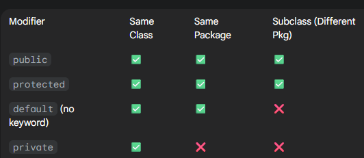
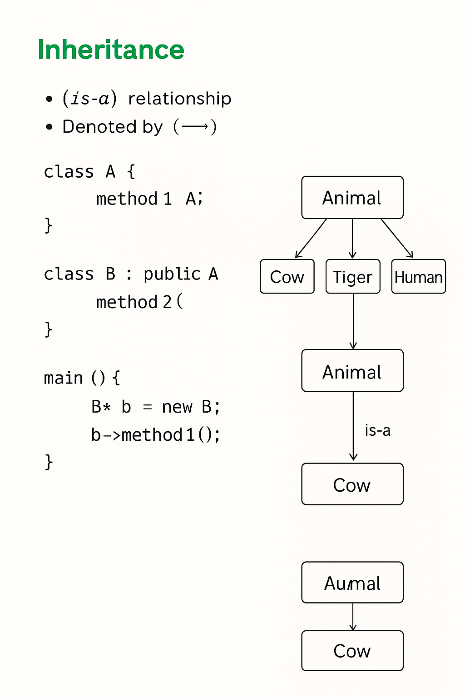
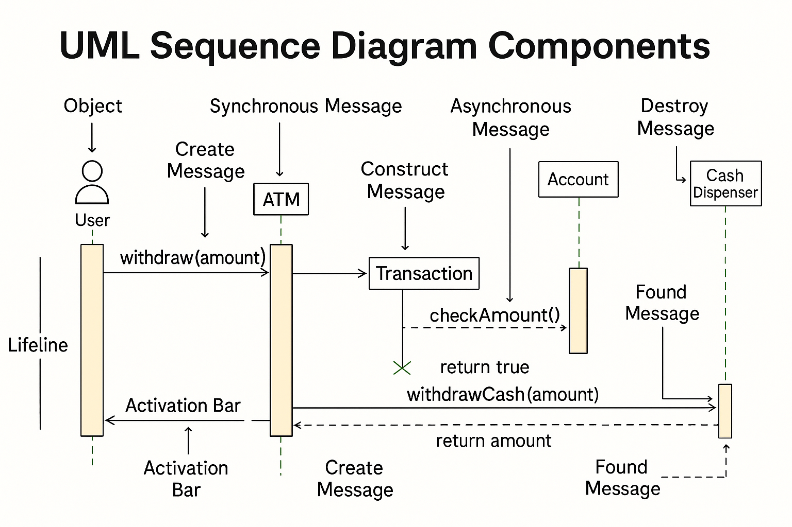

# Unified Modeling Language (UML) Diagrams

UML (Unified Modeling Language) is a standardized **visual language** used to **blueprint a system's design**, much like engineering blueprints.  
It is a **modeling tool, not a programming language**.

---

## Types of UML Diagrams
1. **Structural**
2. **Behavioral**

---

## 1. Structural Diagram

### Class Diagram
The **class diagram** is the most common UML diagram.  
It illustrates a system's **static structure** by showing classes, attributes, methods, and their relationships.  
It is the foundational building block for **object-oriented software**.

---

### Anatomy of a Class 🧱

A **class** is a blueprint for creating objects.  
It defines a set of **attributes (data)** and **methods (behaviors)**.

Example:

```
<<abstract>> Car
-------------------------------
+ brand: String
+ model: String
+ engineCC: int
-------------------------------
- startEngine(): void
- stopEngine(): void
- accelerate(): void
- brake(): void
```

- **Class Name**: `Car`  
  - `<<abstract>>` → This class cannot be instantiated directly; it must be extended.  
- **Attributes (Variables)**:  
  - `brand`, `model`, `engineCC` are car properties.  
- **Methods (Behaviors)**:  
  - Actions such as `startEngine()`, `brake()`.  
- **Visibility**:  
  - `+` **Public** → accessible anywhere.  
  - `-` **Private** → accessible only within the class.  
  - `#`**protected**-> access only in child class.



---

## Relationships Between Classes 🤝

Classes/objects interact through **associations**.

### 1. Inheritance (is-a)
- Defines an **“is-a” relationship**.  
- A subclass inherits from a parent class.  
- Example: `Bmw` is a `Car`.  
- UML Symbol: Arrow (▲).  

```cpp
class A {
    void method1();
};

class B : public A {
    void method2();
};

int main() {
    B* b = new B();
    b->method1();  // inherited from A
    b->method2();  // defined in B
}
```



---

### 2. Association (uses-a)
- **Definition**: Two objects interact but live independently.  
- **Example**: `Arjun → House`  
- **UML Symbol**: Simple line (`-->`).  

### 3. Aggregation (has-a)
- **Definition**: "Whole–part" relationship, but parts can exist independently.  
- **Example**: `Room → Chair`  
- **UML Symbol**: Hollow diamond (`o--`).  

### 4. Composition (owns-a / part-of)
- **Definition**: Strongest "has-a" relationship.  
- The part depends on the whole for existence.  
- **Example**: `Car → Engine`  
- **UML Symbol**: Filled diamond (`*--`).  

---

## Java Examples

### 1. Association (Person uses-a House)
```java
class House {
    void show() {
        System.out.println("This is a house.");
    }
}

class Person {
    void liveIn(House house) {
        house.show();
    }
}
```

### 2. Aggregation (Room has-a Chair)
```java
class Chair {
    void sit() {
        System.out.println("Sitting on the chair.");
    }
}

class Room {
    private Chair chair;

    Room(Chair chair) {
        this.chair = chair;
    }

    void useRoom() {
        chair.sit();
    }
}
```

### 3. Composition (Car owns-a Engine)
```java
class Engine {
    void start() {
        System.out.println("Engine starting...");
    }
}

class Car {
    private Engine engine;

    Car() {
        engine = new Engine();  // Engine lifecycle tied to Car
    }

    void drive() {
        engine.start();
        System.out.println("Car is driving...");
    }
}
```

### Main Program
```java
public class RelationshipsDemo {
    public static void main(String[] args) {
        // Association
        System.out.println("=== Association ===");
        Person arjun = new Person();
        House myHouse = new House();
        arjun.liveIn(myHouse);

        // Aggregation
        System.out.println("\n=== Aggregation ===");
        Chair c = new Chair();     
        Room r = new Room(c);      
        r.useRoom();

        // Composition
        System.out.println("\n=== Composition ===");
        Car car = new Car();
        car.drive();
    }
}
```

---

## 2. Behavioral Diagram

### Sequence Diagram
A **sequence diagram** shows **interaction between objects in a sequential order**  
(i.e., the order in which interactions happen).  




If I made a mistake, please email me at prajapatipiyush851@gmail.com.